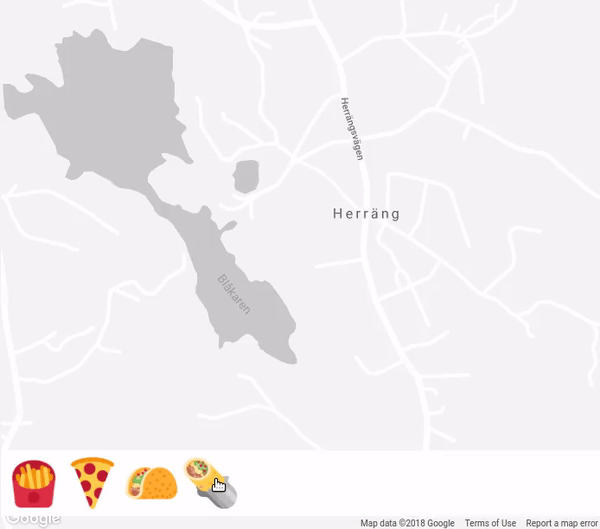

# Geo Food


> Tasty demo for turtlequeue event subscription sdk 🌯



# Usage

### Credentials

Get your api key for turtlequeue from [turtlequeue.com](https://turtlequeue.com)

Get your api key for gmap from [developers.google.com/maps/documentation/javascript/get-api-key](https://developers.google.com/maps/documentation/javascript/get-api-key)

Either fill a .env file based on [.env.sample](./.env.sample) or expose then as env var

### Launch

```
yarn install

yarn dev
```

# Technologies

### TurtleQueue

Used to broadcast a message (ie: a burito emoji) to peers connected to the app.

### React

This app uses React and relies on react hooks. Which are quite cool but might looks weird if you are not use to it. Take a look at [reactjs.org/docs/hooks-intro](https://reactjs.org/docs/hooks-intro.html)

### GMap

Expect some hacky piece of code to achieve marker animation on the map 🙍

### Emotion

Provides elegant way to use css in js

# Authors

- Arthur Brongniart https://github.com/Platane (main author)
